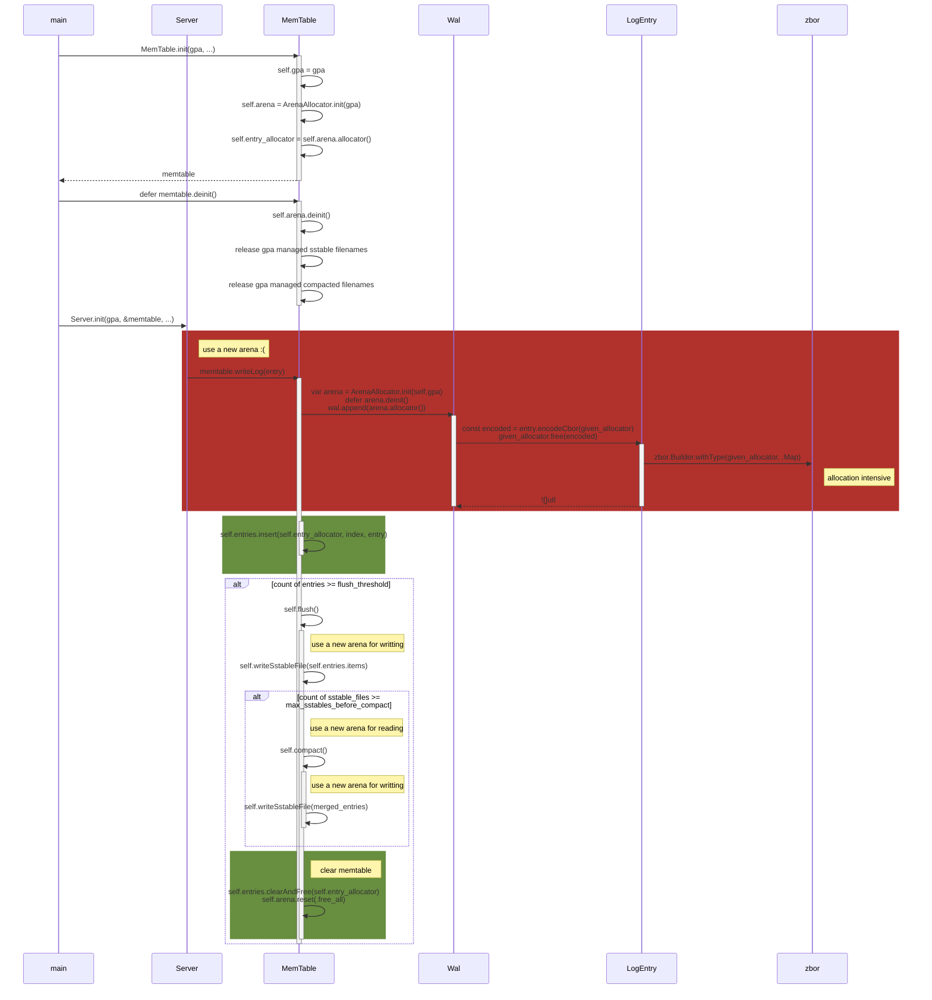

# Allocator Usage Pattern

## Persistency

```mermaid
sequenceDiagram
    participant main
    participant Server
    participant MemTable
    participant Wal
    participant LogEntry
    participant zbor


    %% main -> MemTable

    main->>MemTable: MemTable.init(gpa, ...)
    activate MemTable
        MemTable->>MemTable: self.gpa = gpa
        MemTable->>MemTable: self.arena = ArenaAllocator.init(gpa)
        MemTable->>MemTable: self.entry_allocator = self.arena.allocator()
        MemTable-->>main: memtable
    deactivate MemTable

    main->>MemTable: defer memtable.deinit()
    activate MemTable
        MemTable->>MemTable: self.arena.deinit()
        MemTable->>MemTable: release gpa managed sstable filenames
        MemTable->>MemTable: release gpa managed compacted filenames
    deactivate MemTable


    main->>Server: Server.init(gpa, &memtable, ...)

    %% Server -> MemTable: writeLog

    rect rgb(177, 49, 44)
    note right of Server: use a new arena :(

    Server->>MemTable: memtable.writeLog(entry)
    %% writeLog
    activate MemTable
        MemTable->>Wal: var arena = ArenaAllocator.init(self.gpa)<br/>defer arena.deinit()<br/>wal.append(arena.allocator())
        activate Wal

            Wal->>LogEntry: const encoded = entry.encodeCbor(given_allocator)<br/>given_allocator.free(encoded)
            activate LogEntry

                LogEntry->>zbor: zbor.Builder.withType(given_allocator, .Map)
                note right of zbor: allocation intensive

                LogEntry-->>Wal: ![]u8

            deactivate LogEntry

        deactivate Wal

    %% end rect
    end

    rect rgb(104, 142, 64)
    activate MemTable
        MemTable->>MemTable: self.entries.insert(self.entry_allocator, index, entry);
    deactivate MemTable
    %% end rect
    end

    alt count of entries >= flush_threshold
        MemTable->>MemTable: self.flush()
        activate MemTable
        
            note right of MemTable: use a new arena for writting
            MemTable->>MemTable: self.writeSstableFile(self.entries.items)

            alt count of sstable_files >= max_sstables_before_compact
                note right of MemTable: use a new arena for reading
                MemTable->>MemTable: self.compact()
                activate MemTable
                    note right of MemTable: use a new arena for writting
                    MemTable->>MemTable: self.writeSstableFile(merged_entries)
                deactivate MemTable
            end

            rect rgb(104, 142, 64)
            note right of MemTable: clear memtable

            MemTable->>MemTable: self.entries.clearAndFree(self.entry_allocator)<br/>self.arena.reset(.free_all);
            %% end rect
            end

        deactivate MemTable
    %% end alt
    end

    %% end writeLog
    deactivate MemTable
```
